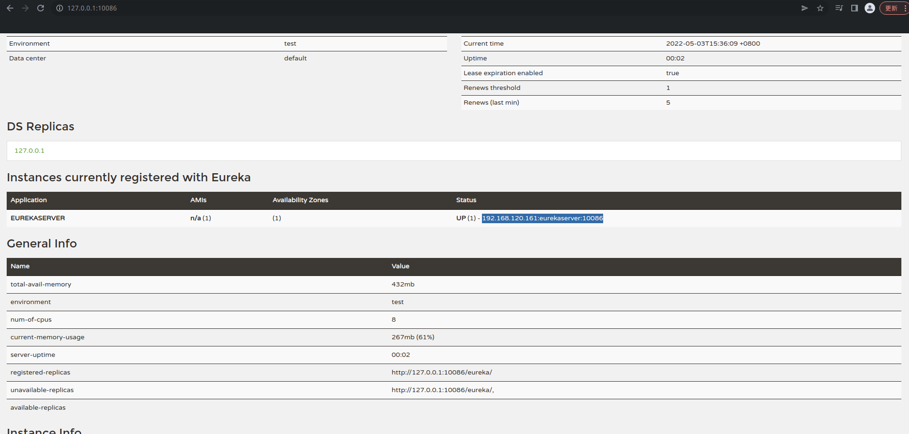
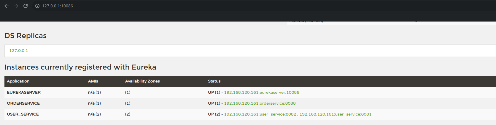
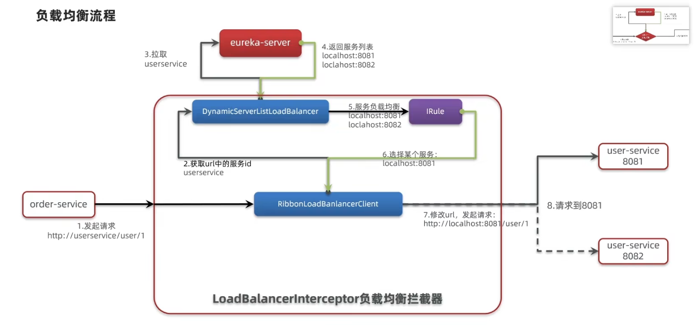

# 远程调用的方式

## 1-最基本的调用方式

RestTemplate是最基本的远程调用方式，只需注入RestTemplate对象，调用对应的API请求下游系统即可。

```java
public Order queryOrderById(Long orderId) {
    // 1.查询订单
    Order order = orderMapper.findById(orderId);

    /*
     day01-1：远程调用的雏形-RestTemplate，属于是最基本的远程调用方式
     */
    User user = restTemplate.getForObject(String.format("http://localhost:8081/user/%s", order.getUserId()), User.class);
    order.setUser(user);
    
    return order;
}
```

# 注册中心

## 2-远程调用的问题

在知识点1中可以发现，远程调用的提供者是采用硬编码的方式写死在消费者的url里，这样非常不灵活。因此可以引入“注册中心”这个角色，每当一个提供者启动时候都主动注册进注册中心里，当消费者需要调用时，只需根据“服务内容”向注册中心请求提供者的信息，注册中心根据特定规则将符合条件的提供者返回给消费者。

打个比方，如**订单服务**需要请求**用户服务**的**用户信息接口**，**订单服务**需要将**用户信息接口**这个服务内容作为参数请求注册中心，注册中心根据特定规则，将符合条件的**用户服务**提供者信息返回给**订单服务**，**订单服务**再通过远程调用的方式请求接口，获得最终结果。

## 3-Eureka

注册中心有很多种，虽然每一种的大致功能都一样，但细微的实现可能略有不同，现以Eureka举例（**Eureka已经逐渐被淘汰了，这里提出来只是作为入门知识了解注册中心的作用**）。Eureka有个特点是：Eureka会将所有提供者的信息返回给消费者，消费者再通过负载均衡的方式选择一个来请求。

### 搭建

引入依赖：

```xml
<dependency>
    <groupId>org.springframework.cloud</groupId>
    <artifactId>spring-cloud-starter-netflix-eureka-server</artifactId>
</dependency>
```

启动类加上启动注解：

```java
@EnableEurekaServer
@SpringBootApplication
public class EurekaApplication {
    public static void main(String[] args) {
        SpringApplication.run(EurekaApplication.class, args);
    }
}
```

添加配置，指定Eureka服务端的信息：

```yaml
eureka:
  client:
    service-url:  # eureka的地址信息
      defaultZone: http://127.0.0.1:10086/eureka
```

当服务启动后，访问主机的10086/eureka后，就能访问进eureka主页了：



### 注册

搭建好eureka服务器后，需要将提供者注册进eureka内。

提供者与消费者引入依赖：

```xml
<dependency>
    <groupId>org.springframework.cloud</groupId>
    <artifactId>spring-cloud-starter-netflix-eureka-client</artifactId>
</dependency>
```

提供者与消费者添加配置：

```yaml
spring:
  application:
  	#注册进eureka后的名字
    name: user_service
eureka:
  client:
    service-url:  # eureka的地址信息
      defaultZone: http://127.0.0.1:10086/eureka
```

注册进eureka的配置信息与eureka服务器配置一样，区别是引入的依赖是client端。

启动了消费者和提供者后(提供者启动2个)，eureka的列表信息如下：



### 使用

搭建eureka、注册提供者和消费者后，就到消费者的使用了。

注入RestTemplate的时候，增加@LoadBalanced注解：

```java
//day01-3：在restTemplate上面加上@LoadBalanced注解，配合Eureka注册中心，实现负载均衡
@LoadBalanced
@Bean
public RestTemplate restTemplate() {
    return new RestTemplate();
}
```

服务调用的时候，消费者请求提供者的${主机+端口}直接改成${服务名}，注意服务名不能有下划线_ssss：

```java
User user = restTemplate.getForObject(String.format("http://userservice/user/%s", order.getUserId()), User.class);
```

# 负载均衡

知识点3讲到，消费者从eureka获取到所有提供者的主机信息，然后进行负载均衡请求，那么是谁做负载均衡？又是什么时候做的呢？回到@LoadBalanced注解，当RestTemplate被加入@LoadBalanced注解后，调用请求时会被LoadBalanceInterceptor拦截处理请求，**然后被loadBalancer进行处理，在Eureka中默认采用RibbonLoadBalancerClient处理**。最终通过IRule根据特定规则返回本次请求的目的地，默认采用ZoneAvoidanceRule这个规则，当然，也可以采用配置的方式更改或手动实现负载均衡规则。


