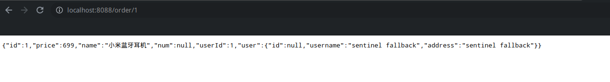

# 服务雪崩

## 23-服务雪崩与解决方案

微服务之间的调用本质是网络请求，网络请求就意味着有可能会因为网络原因导致下游服务不可用，甚至下游服务本身异常导致服务不可用。如1个请求打到服务A，服务A为了完成请求的业务，需要调用服务B，若服务A与B之间的网络发生故障，或者服务B本身由于代码异常导致无法响应正常结果给服务A，这个请求就会占用着服务A的线程，导致这个线程不可用。**当这类请求累计到一定次数，服务A的Tomcat请求线程数耗尽，最终导致服务A整个不可用**。服务A在微服务中一旦不可用，就有可能作为“服务B”这个角色导致上游服务也不可用，从而导致整个微服务瘫痪，这就是服务雪崩。

为了解决服务雪崩，以上面的服务AB举例，其实有以下几种方案：

1. 超时时间：设置超时时间，让服务A对服务B的请求是有兜底的，当A对B的请求时间超过timeout，服务A抛出异常给上层方法处理，使本次请求结束。但是！！！超时时间要怎么设，设多少是一个比较复杂的问题。如果太短，服务B来不及响应，整个请求就结束了。如果太长，在超时时间之前若发生大批量同样的请求，最终的结局也是服务雪崩。所以设置超时时间并不是一个最优解。
2. 线程隔离：按照业务划分线程池，让某个业务的请求到达Tomcat后，只使用这个业务的线程池来处理，这样即使下游发生了故障，也只是耗尽了这个线程池的资源，并非整个Tomcat。当然，这个方法也不太好用，不仅难划分线程池，而且效率很差。
3. 熔断降级：通过**断路器**统计业务执行的异常比例，如果超出这个阈值则会熔断该业务，拦截这个业务的一切请求。当断路器发现服务A请求服务B的异常次数达到一定阈值时，服务A再次请求服务B会直接抛出一个异常，不让A访问下去，上层方法需要根据这个异常自定义解决方案。
4. 流量控制：限制业务访问的QPS，避免服务B因为流量的激增而发生故障。当然这个属于预防方案，并非服务异常的应对方案。

## 24-服务保护

为了避免知识点23提出的服务雪崩，一般都是使用现有的服务保护框架，它整合了知识点23提出的解决方案，可以达到预防与应对的作用。目前主流有Sentinel与Hystrix这两种。Hystrix是早期学习微服务的时候了解到的框架，但是它已经停止维护了，而且相比Sentinel也有很多缺点，所以目前和将来，更多会关注于Sentinel的使用，以下是它们两个之间的差别：

|                        |            Sentinel            |      Hystrix      |
| ---------------------- | :----------------------------: | :---------------: |
| 线程隔离策略           | 信号量（联动OS笔记03 同步.md） | 线程池隔离/信号量 |
| 熔断降级策略           |    基于满调用比例和异常比例    |   基于失败比例    |
| 实时指标实现（TODO）   |        滑动窗口（TODO）        | 滑动窗口（TODO）  |
| 规则配置               |         支持多种数据源         |  支持多种数据源   |
| 扩展性                 |           多个扩展点           |       插件        |
| 基于注解整合           |              支持              |       支持        |
| 限流（流量控制）       |    基于QPS、调用关系的限流     |    有限的支持     |
| 流量整形               |    支持慢启动、匀速排队模式    |      不支持       |
| 系统自适应保护（TODO） |              支持              |      不支持       |
| 控制台                 |            非常完善            |      不完善       |

# 整合Sentinel

## 25-sentinel控制台的搭建

有点类似Nacos，Sentinel关键实现需要耦合在服务实例的代码里，控制台起到监控和热更改的作用，首先下载官方提供的sentinel-dashboard的jar包，它已经集成好前后端功能了，只需java -jar打开即可，默认端口是8080，默认账密是sentinel

## 26-代码整合sentinel

引入依赖：

```xml
<dependency>
    <groupId>com.alibaba.cloud</groupId>
    <artifactId>spring-cloud-starter-alibaba-sentinel</artifactId>
</dependency>
```

添加配置：

```yaml
spring:
	cloud:
		sentinel:
      		transport:
        		dashboard: localhost:8080
```

服务实例启动后，访问一次服务实例，触发sentinel监控：


# Sentinel使用

## 27-Sentinel使用之簇点链路与基本流控

簇点链路即Sentinel'被监控的一个资源，默认情况下Sentinel的簇点链路是SpringMVC的每一个接口，也就是说默认情况下SpringMVC的每一个接口都是Sentinel被监控的资源。熔断和流控都是基于资源来控制的。

Sentinel最基本的流控是限定资源的QPS，在流控操作中可以配置，如修改/order/{orderId}这个接口（资源）的QPS不能超过1，否则直接流控：


此时不停地请求，可以看到触发了Sentinel的流控机制：


## 28-Sentinel使用之流控模式

Sentinel流控模式有3种：直接、关联、链路，默认使用直接模式。

1. 直接：统计**当前资源**的请求，当达到阈值时直接对**当前资源**限流，知识点27就是典型的直接模式。
2. 关联：统计当前资源关联的**另一个资源的请求**，到达阈值时对**当前资源**限流。
3. 链路：统计**来自指定链路**访问当前资源的请求，到达阈值时只对**来自该链路的请求**限流。

1其实比较好理解，但2和3的应用场景在哪呢？

### 关联

先说2，假设有这么个场景：查询订单和创建订单，对于产品来说，肯定是创建订单重要点毕竟有收益。如果在业务高峰期大部分是创建订单的请求，那么就有必要限制一下查询订单的请求，让多余的线程去服务创建订单，保证生产收益，至于查询请求可以放缓或者拒绝，让用户过一会儿再访问。落实到关联模式的话，当前资源就是查询订单接口，另一个资源就是创建订单接口。用以下orderservice代码举例：

```java
    @GetMapping("/query")
    public String queryOrder() {
        System.err.println("查询订单");
        return "查询订单成功";
    }

    @GetMapping("/save")
    public String saveOrder() {
        System.err.println("新增订单");
        return "新增订单成功";
    }
```

我希望save接口QPS达到2时，限制query接口的访问，保证更多的线程来服务save接口：


### 链路

再说3.的场景，这次是查询订单和新增订单。正常业务场景下，这两个接口都会触发商品的查询，现在的需求希望优先保证新增订单的商品查询功能，减少查询订单的商品查询功能，**这时候资源应该作为一个service-api来处理**，而不是一个handler来处理了。sentinel对此的实现很简单，只需在对应api上面加上@SentinelResource(资源名)即可：

```java
@SentinelResource("goods")
public void queryGoods(){
    System.err.println("查询商品");
    secondService.querySecond();
}
```

```java
@Service
public class SecondService {
    
    @SentinelResource("second")
    public void querySecond(){
        System.err.println("查询商品2");
    }
    
}
```

```java
@GetMapping("/query")
public String queryOrder() {
    // 查询商品
    orderService.queryGoods();
    // 查询订单
    System.err.println("查询订单");
    return "查询订单成功";
}

@GetMapping("/save")
public String saveOrder() {
    // 查询商品
    orderService.queryGoods();
    // 查询订单
    System.err.println("新增订单");
    return "新增订单成功";
}
```

但是！！！默认情况下Sentinel只会基于MVC路由器为根节点去派生资源，也就是说默认情况下只将系统上的handler作为资源，而不是API。想要细分到API级别需要加上配置：

```yaml
spring:
	cloud:
		sentinel:
      		transport:
        		dashboard: localhost:8080
        	web-context-unify: false # 关闭context整合
```

这样刷新一下sentinel，就会发现资源从细分到handler变成细分到resource-api了，甚至还能细分resource-api调用了哪些其他resource-api（前提得通过注入方式调用）：


回到需求，我希望service-api1这个方法在查询订单时能控制好QPS，只需这样配置：


这样，当query接口导致的goods-api调用超出阈值，就会限流，返回失败信息，而save接口导致的goods-api却不会。

## 29-Sentinel使用之流控效果

知识点28讲述的流控模式定义**什么时候触发流控**，而这里的流控效果定义**触发流控之后，该怎么Sentinel该怎么做**。主要有三种：

1. 快速失败：知识点27和知识点28演示的就是快速失败，触发流控后直接抛出FlowException，建议在代码上对这个异常做全局处理。

2. Warm Up：和快速失败差不多，不过最初的阈值是很低的，会从最低值逐渐变化为自定义值。初始最低值为(自定义值/coldFactor)，coldFactor默认为3。

3. 排队等待：和前面2种不太一样，它们都是超出阈值就响应失败。但排队等待是将请求放在1个队列里，按照**阈值划分时间间隔**依次执行，这个队列是FIFO的，如果请求在进队列前发现等待时间（可以根据时间间隔x对内请求数算出）超过**设置好的timeout**，则响应请求失败。如图所示：

   

   这时QPS=5，timeout=2000ms的效果，如果timeout时间长一点、或者QPS阈值大一点，那么队列里的节点数也会变多。使用排队等待效果，可以达到流量削峰和流量整形的作用，而不是直接拒绝。

## 30-Sentinel使用之热点参数限流

这个功能是细化到同一资源不同请求参数的限流了，比如某个资源它被传入参数A的次数会比参数B的次数多很多，就可以配置资源被传入参数A时候的QPS，而传入参数B时不受影响，不过这个功能有两个槽点，因此这里仅作为了解，有需要的话以后翻阅文档查看：

1. 必须是@SentinelResource注解之下的资源，虽然handler或者service-api都可以这样用。
2. 只能限定参数类型为基本数据类型、String的资源，如果采用对象包装参数的方式，就不可用了。

## 31-Sentinel限流资源的粒度

由大到小分别是：handler（默认）、service-api（配置web-context-unify: false）、参数（配置参数限流）。

## 32-隔离与熔断

限流只是用来控制QPS，防止因QPS过高引起的服务故障，**属于预防作用**。但是对于已经发生故障的下游来说，流控起不到任何作用，这时候就需要Sentinel的隔离和熔断来对**资源故障**进行处理了。注意，这里阐述的是资源，而非下游服务，对于Sentinel来说，不管是熔断，限流还是隔离，都是针对资源来说的，而不是远程调用，**只不过实际开发中更多远程调用做这三个操作**。比如说我可以对handler做隔离熔断，也可以对service-api做隔离熔断。

## 33-Sentinel使用之自定义降级

什么是降级？我这里下一个定义：**当请求资源发生流控、隔离、熔断后，Sentinel做出的处理，默认是抛出一个异常。**但是正常情况下仅依赖Sentinel默认抛异常肯定是不足够的，所以需要我们开发来自定义降级逻辑，有2种方式：1.整合Feign，对feign的请求自定义降级逻辑 2.整合@SentinelResource，对sentinel资源的处理自定义降级逻辑。

### 自定义降级整合Feign

1. 修改配置：

```yaml
feign:
	sentinel:
		enabled: true
```

2. 在feign模块自定义FallbackFactory，声明具体的降级逻辑：

   ```java
   @Component
   public class UserClientFallbackFactory implements FallbackFactory<UserClient> {
       @Override
       public UserClient create(Throwable throwable) {
           return new UserClient() {
               @Override
               public User queryById(Long id) {
                   User user = new User();
                   user.setUsername("sentinel fallback");
                   user.setAddress("sentinel fallback");
                   return user;
               }
           };
       }
   }
   ```

3. 对@FeignClient声明使用哪个失败工厂：

   ```java
   @FeignClient(value = "userservice",fallbackFactory = UserClientFallbackFactory.class)
   public interface UserClient {
       @GetMapping("/user/{id}")
       User queryById(@PathVariable("id") Long id);
   }
   ```

4. 毕竟是跨模块导包，记得在client使用方的服务里加上包扫描：

   ```java
   @ComponentScan(basePackages = {"cn.itcast.commonfeign","cn.itcast.order"})
   public class OrderApplication {
   }
   ```

5. 此时就能发现FeignClient对应的方法成功作为**资源**整合进sentinel里了：

   

6. 实验一下给这个资源限制QPS=2，触发流控规则，看看效果：

   

### 对@SentinelResource自定义降级

有以下代码，如果要对customOrder这个资源自定义降级，该如何做呢？

```java
@GetMapping("/customOrder")
public Order customOrder(){
    return orderService.customOrder();
}
```

```java
@SentinelResource("customOrder")
public Order customOrder(){
    Order order = new Order();
    order.setName("自定义订单");
    order.setNum(3);
    order.setPrice(999L);
    return order;
}
```

1. 新建自定义降级方法，方法参数和返回值需要与整合的资源一致：

   ```java
   public Order customOrderFallback(){
       Order order = new Order();
       order.setName("sentinel resource fallback");
       order.setNum(-1);
       order.setPrice(-1L);
       return order;
   }
   ```

2. 在@SentinelResource内声明降级方法名（降级方法和资源需要在同一类）：

   ```java
   @SentinelResource(value = "customOrder",fallback = "customOrderFallback")
   public Order customOrder(){
       Order order = new Order();
       order.setName("自定义订单");
       order.setNum(3);
       order.setPrice(999L);
       return order;
   }
   
   public Order customOrderFallback(){
       Order order = new Order();
       order.setName("sentinel resource fallback");
       order.setNum(-1);
       order.setPrice(-1L);
       return order;
   }
   ```

3. 最终效果：

   

## 34-隔离

对于资源不可用的情况，可以通过隔离的方式**将资源不可用的影响限定在某个范围，避免耗尽Tomcat线程**，Sentinel提供两种方案：1.线程池隔离 2.信号量 默认使用信号量。

### 线程池隔离


Sentinel会对每个**资源**划分出1个线程池，当**调用资源**时候，并非使用Tomcat处理请求的**原生线程**，而是使用资源对应的线程池里的线程。**一旦发现线程池没有剩余线程了，就进行降级处理**。线程池的好处是支持主动超时和异步调用，但缺点是对线程资源有额外开销，比较适合低扇出的架构。

### 信号量隔离


联动OS笔记03 同步.md，Sentinel对每个资源划分出 1个信号量，可以把它理解为一个**共享互斥锁**。原生线程调用资源时会获取信号量，当发现信号量获取失败时就进行降级处理。信号量隔离的好处是轻量级，没有额外的线程开销。但缺点是不支持超时和异步调用，只能依赖客观的超时来释放信号量。

信号量的使用：


对资源配置流控，选择阈值类型为“线程”，单机阈值即信号量的值

假如我对服务提供者userservice的接口故意延迟0.5秒，并且限定了消费者orderservice的userclinet的信号量为2。超出2的阈值就会走降级逻辑：

```java
public User queryById(Long id) {
    try {
        Thread.sleep(500);
    } catch (InterruptedException e) {
        e.printStackTrace();
    }
    return userMapper.findById(id);
}
```



**但是下一次请求很快又好了，因为前面的请求释放了信号量，新的请求能继续访问下去。**

## 35-熔断

其实限流和隔离，都是针对服务的请求次数、频率做了限制。但熔断是注重于请求资源的效果，其核心思路是通过**断路器**统计请求资源的**异常请求比例、慢请求比例、异常数**。如果这三个指标其中之一超出阈值则会触发降级逻辑。当服务恢复时，断路器会重新放行这个资源的请求。这里提到了5个关键值：断路器、异常请求比例、慢请求比例、阈值、以及断路时间（断路器可不知道资源是否可用，只能断路一段时间，在这个时间过后尝试放行部分请求，如果符合要求，则完全放行，否则继续断路）。


那么这个“失败阈值”如何划分其实很重要，Sentinel提供了3种阈值划分：慢调用、异常比例、异常数。通过Sentinel配置资源的“降级”可以看到以下信息

慢调用：


如果这个资源在10秒内，被请求数超过10，并且资源处理时间超过500ms的请求比例占10秒内所有请求的50%，则触发熔断，熔断5秒后断路器进入半开状态，尝试放行。

异常比例：


如果这个资源在10秒内，被请求数超过10，并且资源出现异常的请求比例占10秒内所有请求的40%，则触发熔断，熔断5秒后断路器进入半开状态，尝试放行。

异常数：


和异常比例相似，只不过这次阈值是10秒内的异常数。
